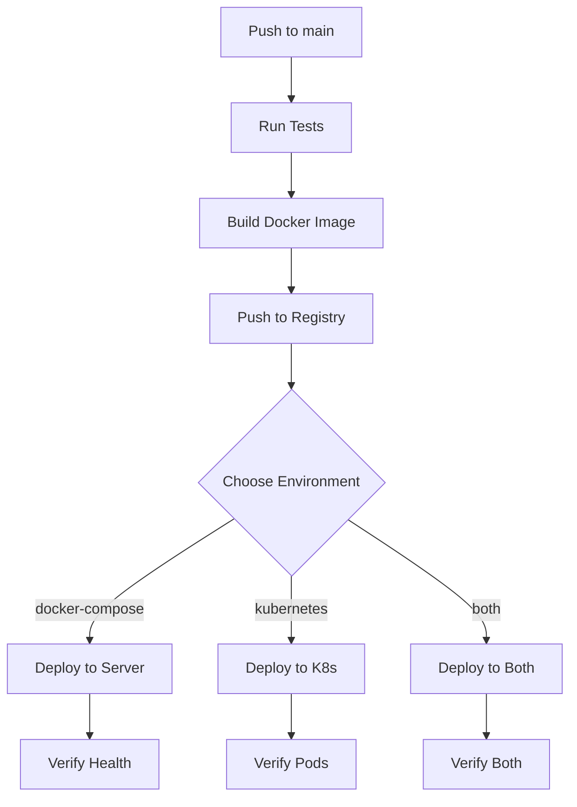

# CI/CD Setup для FixDrive

## 🎯 Обзор

Теперь у тебя есть **гибкий CI/CD pipeline**, который поддерживает два способа деплоя:
1. **Docker Compose** (существующий) - на твой сервер 31.97.76.106
2. **Kubernetes** (новый) - в любой Kubernetes кластер

## 🔧 Настройка GitHub Secrets

### Обязательные секреты для Docker Compose:
```bash
ENV_FILE              # Твой .env файл
SSH_PRIVATE_KEY       # SSH ключ для доступа к серверу
```

### Новые секреты для Kubernetes:
```bash
# Docker Hub
DOCKER_USERNAME       # Логин в Docker Hub
DOCKER_PASSWORD       # Пароль/токен Docker Hub

# Kubernetes
KUBE_CONFIG          # kubeconfig файл (base64)

# Переменные окружения для приложения
DB_PASSWORD          # password
JWT_SECRET           # your-super-secret-jwt-key-change-in-production
TWILIO_ACCOUNT_SID   # ACxxxxxxxxxxxxxxxxxxxxxxxxxxxxxxxxx
TWILIO_AUTH_TOKEN    # your_twilio_auth_token_here
TWILIO_FROM_PHONE    # +1234567890
```

## 🚀 Как использовать

### 1. Автоматический деплой (на push в main):
```bash
git push origin main
# По умолчанию деплоится в docker-compose
```

### 2. Ручной деплой с выбором среды:
```bash
# В GitHub Actions → Run workflow → выбери:
- docker-compose  # Старый способ
- kubernetes     # Новый способ  
- both          # Оба одновременно
```

### 3. Локальные команды:
```bash
# Kubernetes
make k8s-deploy     # Деплой
make k8s-status     # Статус
make k8s-logs       # Логи
make k8s-restart    # Перезапуск

# Docker
make docker-build   # Собрать образ
make docker-push    # Загрузить в registry
```

## 📋 Шаги настройки

### 1. Настройка Docker Hub

```bash
# 1. Зарегистрируйся на hub.docker.com
# 2. Создай репозиторий: username/fixdrive
# 3. Создай Access Token в настройках
# 4. Добавь в GitHub Secrets:
#    DOCKER_USERNAME = твой_логин
#    DOCKER_PASSWORD = токен_доступа
```

### 2. Настройка Kubernetes кластера

```bash
# Для minikube (локально):
minikube start
kubectl config view --raw --minify > kubeconfig.yaml
cat kubeconfig.yaml | base64 -w 0 > kubeconfig.base64
# Содержимое kubeconfig.base64 → GitHub Secret KUBE_CONFIG

# Для облачных кластеров:
# AWS EKS: aws eks update-kubeconfig --name cluster-name
# GCP GKE: gcloud container clusters get-credentials cluster-name
# Azure AKS: az aks get-credentials --name cluster-name
```

### 3. Обновление переменных окружения

```bash
# Добавь в GitHub Secrets каждую переменную отдельно:
DB_PASSWORD = your_db_password
JWT_SECRET = your-super-secret-jwt-key-here
TWILIO_ACCOUNT_SID = ACxxxxxxxxxxxxxxxxxxxxxxxxxxxxxxxxx
TWILIO_AUTH_TOKEN = your_twilio_auth_token_here
TWILIO_FROM_PHONE = +1234567890
```

## 🔄 Workflow процесс



## 📊 Мониторинг

### GitHub Actions:
- Логи деплоя в Actions tab
- Status checks на PR
- Уведомления о сбоях

### Kubernetes:
```bash
# Статус
kubectl get all -n fixdrive

# Логи
kubectl logs -f deployment/fixdrive-app -n fixdrive

# Health check
kubectl get pods -n fixdrive | grep Running
```

### Docker Compose:
```bash
# SSH на сервер
ssh root@31.97.76.106

# Статус
cd /app && docker-compose ps

# Логи
docker-compose logs -f
```

## 🚨 Troubleshooting

### Ошибки Docker Registry:
```bash
# Проверь логин
docker login

# Проверь права
docker push username/fixdrive:test
```

### Ошибки Kubernetes:
```bash
# Проверь доступ
kubectl cluster-info

# Проверь namespace
kubectl get ns | grep fixdrive

# Проверь секреты
kubectl get secrets -n fixdrive
```

### Rollback:
```bash
# Kubernetes
kubectl rollout undo deployment/fixdrive-app -n fixdrive

# Docker Compose
ssh root@31.97.76.106 "cd /app && git checkout HEAD~1 && docker-compose up -d --build"
```

## 🎉 Преимущества нового CI/CD:

✅ **Гибкость**: Выбор среды деплоя  
✅ **Надежность**: Автоматические проверки  
✅ **Масштабируемость**: Готовность к production  
✅ **Мониторинг**: Логи и статусы  
✅ **Безопасность**: Управление секретами  
✅ **Откат**: Быстрый rollback при ошибках  

## 🔮 Следующие шаги:

1. **Environments**: Создай dev/staging/prod среды
2. **Tests**: Добавь интеграционные тесты
3. **Security**: Сканирование образов
4. **Monitoring**: Prometheus + Grafana
5. **GitOps**: ArgoCD для K8s 